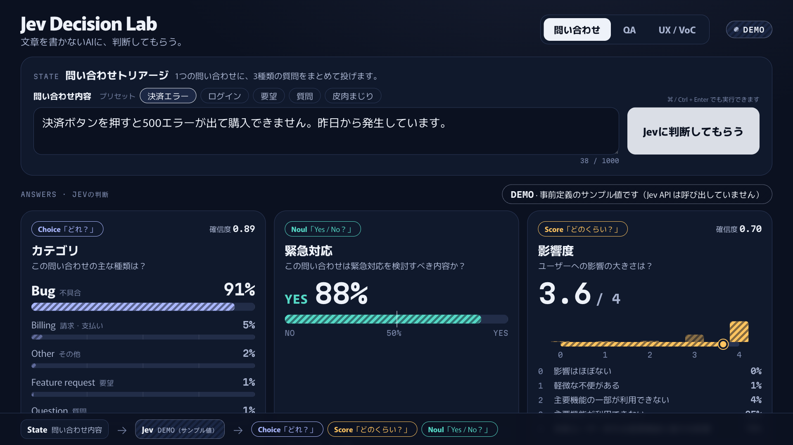

# Jev Decision Lab

**文章を書かないAIに、判断してもらう。**

TypeSafe AI の **Jev** を、勉強会のライブデモで体験するための Web アプリです。
1つの入力（State）に対して、Jev が **型付きの判断（Choice / Score / Noul）と確率** を返す様子を、1画面で見せます。



---

## 目次

1. [このアプリの目的](#1-このアプリの目的)
2. [必要環境](#2-必要環境)
3. [インストール](#3-インストール)
4. [TypeSafe API key 設定](#4-typesafe-api-key-設定)
5. [LIVE モード起動](#5-live-モード起動)
6. [MOCK モード起動](#6-mock-モード起動)
7. [Jev の基本](#7-jev-の基本)
8. [Choice / Score / Noul について](#8-choice--score--noul-について)
9. [勉強会当日のデモ手順（発表者向けデモシナリオ）](#9-勉強会当日のデモ手順発表者向けデモシナリオ)
10. [トラブル時の対応](#10-トラブル時の対応)

付録: [公開（デプロイ）](#公開デプロイ) / [構成](#構成) / [テスト](#テスト) / [環境変数](#環境変数) / [参考リンク](#参考リンク)

---

## 1. このアプリの目的

プロダクトを作ることが目的ではありません。エンジニア・QA・デザイナーが参加する勉強会で、

> **Jev は文章を生成する AI ではなく、入力に対して「型付きの判断」と「確率」を返す AI である**

ということを、5〜8分のライブデモで直感的に理解してもらうためのアプリです。

- 文章は生成しません。返ってくるのは `choice: "bug"`、`noul: 0.88`、`score: 3.64` のような **型の決まった値** と **確率の分布** です。
- 1回の呼び出しで、Choice・Noul・Score の複数の質問を **まとめて** 評価します。
- 3つのタブで、同じ仕組みを「問い合わせ」「QA」「UX / VoC」の題材に当てはめます。

| タブ | 題材 | 使う質問 |
| --- | --- | --- |
| 問い合わせ | 問い合わせトリアージ | Choice（種類）・Noul（緊急対応）・Score（影響度） |
| QA | QA Semantic Check（「表示されているか」ではなく「意味として正しいか」） | Noul（次の行動が分かるか）・Score（分かりやすさ） |
| UX / VoC | ユーザーの声の分析 | Choice（分類）・Score（不満度）・Noul（改善検討の価値） |

## 2. 必要環境

- Node.js **20.9 以上**（Next.js 16 と TypeSafe 公式 SDK の要件）。Cloudflare 向けのコマンド（`preview:cf` / `deploy:cf`）だけは Node.js 22 以上が必要です
- npm
- TypeSafe AI の API キー（LIVE モードのみ。MOCK モードは不要）

主な構成: Next.js 16（App Router）/ TypeScript / Tailwind CSS 4 / [TypeSafe AI 公式 JavaScript SDK](https://docs.typesafe.ai/sdk/javascript)（`@typesafe-ai/sdk` 0.6.x）/ Vitest

## 3. インストール

```bash
git clone https://github.com/ito-system/jev-decision-lab.git
cd jev-decision-lab
npm install
cp .env.example .env.local   # すでに .env.local がある場合は不要
```

## 4. TypeSafe API key 設定

1. TypeSafe AI のダッシュボード（<https://console.typesafe.ai/keys>）で API キーを発行します。
2. プロジェクト直下の `.env.local` に貼り付けます。

```dotenv
TYPESAFE_API_KEY=ここにAPIキー
JEV_DEMO_MODE=live
```

API キーの扱いについて:

- `.env.local` は `.gitignore` 済みです。**コミットしないでください。**
- API キーはサーバー側（`/api/decide` → Jev Service）だけで使います。ブラウザから Jev API を直接呼ぶことはありません。
- **`NEXT_PUBLIC_` を付けないでください。** 付けるとブラウザ向けの JavaScript に埋め込まれ、誰でも読めてしまいます。
- `npm run build` のあとに `npm run check:bundle` を実行すると、ブラウザ向けのファイルに API キーや SDK の実行コードが含まれていないかを確認できます。

## 5. LIVE モード起動

Jev API を実際に呼び出すモードです。画面右上に **● LIVE** と表示されます。

```bash
# 開発サーバー（.env.local の内容で起動）
npm run dev
# → http://localhost:3000
```

勉強会の本番では、より速く安定する本番ビルドをおすすめします。

```bash
npm run build
npm start
```

- 起動直後に `npm run test:integration` を実行すると、API キー・ネットワーク・質問定義がそろって動くかを確認できます（3タブ分、実際に Jev API を呼びます）。
- `.env.local` を書き換えた場合、`npm run dev` は自動で読み直しますが、`npm start` は再起動が必要です。

## 6. MOCK モード起動

Jev API を呼ばず、事前定義のサンプル値を返すモードです。画面右上に斜線入りの **DEMO** と表示されます。

```bash
npm run dev:mock      # 開発サーバー
# または
npm run build && npm run start:mock   # 本番ビルド
```

`.env.local` で `JEV_DEMO_MODE=mock` にしても同じです。

**本番中にすぐ切り替える方法（再起動不要）:**

- 画面右上の **LIVE** バッジをクリックすると **DEMO** に切り替わります（もう一度クリックで LIVE に戻ります）。
- Jev API の呼び出しに失敗すると「Demo Modeで続行」ボタンが表示されます。押すと DEMO に切り替えて、同じ入力をすぐ再実行します。
- DEMO に切り替えると URL に `?mode=demo` が付き、再読み込みしても DEMO のままです。

Demo Mode の表示について:

- 結果のバーは **斜線のハッチング** で表示し、「DEMO · 事前定義のサンプル値です（Jev API は呼び出していません）」と明記します。実際の Jev の応答と取り違えないためです。
- プリセットの文章には、事前に用意したサンプル値を返します。プリセット以外の文章には、キーワードから作った簡易サンプルを返し、「Jevの判断ではありません」と表示します。
- サンプル値も公式 API と同じ構造で、confidence や score は公式の計算式で確率から求めています。

## 7. Jev の基本

Jev は TypeSafe AI の **System One モデル** です。チャットや文章生成をする LLM とは役割が違います。

```text
State（評価したい内容）  ──▶  Jev  ──▶  型付きの回答 + 確率
                                         Choice「どれ？」
                                         Score「どのくらい？」
                                         Noul 「Yes / No？」
```

- **State**: 評価したい内容。文字列、または JSON（このアプリでは `{ "inquiry": "…" }` のような JSON）。
- **質問（Questions）**: Choice / Score / Noul のいずれか。名前を付けて複数まとめて送れます。
- **回答（Answers）**: 質問と同じ名前で、型の決まった値が返ります。自由な文章は返りません。
- **1回の呼び出しで複数の質問を並列に評価** します。このアプリも各タブの質問を1回の `systemOne` 呼び出しで送っています。
- モデルは公式 SDK の既定の alias **`jev-latest`** を使います（2026年10月時点で `jev-1.13.0` を指します）。レスポンスの `model` に実際に回答したバージョンが入り、画面にも表示します。バージョンを固定したい場合は `TYPESAFE_DEFAULT_MODEL=jev-1.13.0` を設定します。

実際のコード（`lib/jev/service.ts` と `lib/jev/questions.ts` を簡略化）:

```ts
import { TypeSafeClient, choice, noul, score } from "@typesafe-ai/sdk";

const client = new TypeSafeClient(); // TYPESAFE_API_KEY を環境変数から読む

const response = await client.systemOne({
  state: { inquiry: "決済ボタンを押すと500エラーが出て購入できません。昨日から発生しています。" },
  questions: {
    category: choice("この問い合わせの主な種類は？", {
      bug: { what: "期待どおりに動かないという不具合の報告", not_for: "…", examples: ["…"] },
      feature_request: { what: "…" },
      question: { what: "…" },
      billing: { what: "…" },
      other: { what: "…" },
    }),
    urgent: noul("この問い合わせは緊急対応を検討すべき内容か？", { true: "…", false: "…" }),
    impact: score("ユーザーへの影響の大きさは？", [
      "影響はほぼない",
      "軽微な不便がある",
      "主要機能の一部が利用できない",
      "主要機能が利用できない",
      "多数ユーザーまたは重要機能に重大な影響",
    ]),
  },
});

response.answers.category.choice;        // "bug"
response.answers.category.probabilities; // { bug: 0.91, billing: 0.05, … }
response.answers.urgent.noul;            // 0.88（YES である確率）
response.answers.impact.score;           // 3.64（0〜4 の位置）
```

> **注意**: SDK v0.6.0 で Score の `criteria` は「レベル 0 から順に並べた配列」に変わりました（以前の「番号をキーにした辞書」は使えません）。古いブログ記事のコードはそのまま動かないことがあります。

**confidence（確信度）について**: Choice と Score の回答には `confidence`（0〜1）が付きます。これは確率分布がどれだけ1つの選択肢に集中しているかを表す値で、**正解である確率ではありません**。画面にも「Jevが返した判断の確信度・分布です。正解保証ではありません。」と表示しています。Noul には confidence がなく、`noul`（YES の確率）そのものが確からしさを表します。

**日本語について**: 公式ドキュメントによると、Jev の主な学習言語は英語で、日本語を含む他の言語も扱えますが、精度は英語より低い場合があります。勉強会の前に、実際の文章で結果を確認しておいてください（[本番前チェック](#本番前チェックリスト)）。

## 8. Choice / Score / Noul について

| 質問タイプ | ひとことで | 返る値 | このアプリでの例 |
| --- | --- | --- | --- |
| **Choice** | どれ？ | `choice`（選ばれた候補）、`probabilities`（候補ごとの確率）、`confidence` | 問い合わせの種類: bug / feature_request / question / billing / other |
| **Score** | どのくらい？ | `score`（段階の間の値にもなる位置）、`probabilities`（段階ごとの確率）、`legend`、`confidence` | 影響度 0〜4、不満度 0〜4、分かりやすさ 0〜3 |
| **Noul** | Yes / No？ | `noul`（YES である確率、0〜1） | 緊急対応を検討すべきか、改善検討の価値があるか |

質問を作るときのポイント（公式ドキュメントより）:

- **Choice**: 候補ごとに「何が当てはまるか（what）」「何が当てはまらないか（not_for）」「例（examples）」を書き、候補同士の境界をはっきりさせます。このアプリでは「決済画面のエラーは billing ではなく bug」のように、紛らわしい境界を criteria に書いています。
- **Score**: 「やや深刻」のような程度ではなく、「主要機能が利用できない（ログインや購入ができない）」のような **状況** を書きます。各段階は独立して評価されます。
- **Noul**: YES と NO の境界が曖昧にならない問いにします。必要なら `true` / `false` の意味を criteria に書きます。
- 判断の基準（しきい値やルーティング）は、Jev の確率を受け取った **コード側** で決めます。

質問の定義はすべて `lib/jev/questions.ts`（Jev に送る内容）と `lib/scenarios.ts`（画面の表示・プリセット）にあります。

## 9. 勉強会当日のデモ手順（発表者向けデモシナリオ）

全体で5〜8分です。画面の見方は「上段 = 入力（State）」「下段 = Jev の判断（Answers）」「最下部 = 仕組みの図」です。

| # | 時間の目安 | 操作 | 話すこと |
| --- | --- | --- | --- |
| 1 | 0:00 | **問い合わせ** タブを開く | 「入力は問い合わせ1件。これに3つの質問をまとめて投げます」。最下部の図（State → Jev → Choice / Score / Noul）を指す |
| 2 | 0:30 | まだ実行しない | **「この問い合わせ、どんな判断になると思いますか？」** と参加者に聞く。カードの「?」は、これから Jev が埋める値 |
| 3 | 1:00 | **Jevに判断してもらう** を押す | 文字が少しずつ生成されるのではなく、「判断中」→「判断結果」が一度に出ることを見せる |
| 4 | 1:15 | 3つのカードを順に指す | Choice / Noul / Score が **1回の呼び出しで同時に** 返った。各カード下の `choice: "bug"`・`noul: 0.88`・`score: 3.64` が型付きの値。バーは確率の分布。確信度は正解率ではない |
| 5 | 2:30 | プリセット **皮肉まじり** を押す | 「別に困っていないんですけど、昨日から決済が全部失敗しています（笑）」 |
| 6 | 2:45 | 予想してもらってから実行 | 「口調はゆるいけど、Jev はどう判断する？」→ 結果を見る。質問の定義に「口調ではなく、書かれている事象で判断する」と書いてあることを「JSON を見る」で見せると、エンジニアに伝わりやすい |
| 7 | 4:00 | **QA** タブへ | 初期値は「エラーが発生しました。」 |
| 8 | 4:15 | 実行 → プリセット **具体的** でも実行 | 「表示されている？」ではなく **「ユーザーが次の行動を理解できる？」** を判定。右の比較カードで、DOM assertion では確認しにくい「意味」の評価だと説明する。Jev は改善文を書かない（判断だけ）点にも触れる |
| 9 | 5:30 | **UX / VoC** タブへ | ユーザーの声を「分類・不満度・改善価値」の3つの判断に変換する |
| 10 | 5:45 | 実行 → プリセット **乗り換え検討** でも実行 | 分類と不満度の違いを見せる。「この確率をコードでしきい値処理すれば、問い合わせの振り分けや VoC の集計に使える」でまとめる |

締めのひとこと例: 「Jev は文章を書かない。判断と確率を返すだけ。だから、その先はいつものコードで扱える。」

### 本番前チェックリスト

- [ ] `.env.local` に `TYPESAFE_API_KEY` を設定し、`npm run test:integration` が成功する
- [ ] `npm run build && npm start` で起動し、3タブすべてのプリセットを LIVE で一度実行して結果を確認した（日本語の結果が想定と違えば、話し方を準備するか質問定義を調整する）
- [ ] プロジェクターの解像度で表示を確認した（文字の大きさはブラウザのズーム ⌘+ / ⌘- で調整）
- [ ] 右上のバッジで DEMO に切り替えて、3タブとも表示できることを確認した（トラブル時の予行）
- [ ] 通知やチャットのポップアップを止めた

## 10. トラブル時の対応

基本方針: **LIVE で問題が起きたら、迷わず DEMO に切り替えて続ける。** 画面右上のバッジ、またはエラー表示の「Demo Modeで続行」で、再起動なしで切り替えられます。

| 症状・表示 | 原因の例 | 対応 |
| --- | --- | --- |
| 「Jev APIへの接続に失敗しました。」 | Wi-Fi 不調、Jev API の障害、応答が遅い | 「Demo Modeで続行」を押す。応答がない場合も最大20秒ほどでこの表示に切り替わる |
| 「Jev APIのレート制限に達しました。」 | 短時間に呼び出しすぎ（HTTP 429） | 数秒待って「もう一度試す」、または DEMO に切り替える |
| 「Jev APIの認証に失敗しました。」 | API キーの誤り・失効・権限不足 | DEMO に切り替えて続行。終了後に `.env.local` のキーを確認 |
| 「Jev APIキーが設定されていません。」 | `.env.local` にキーがない、`npm start` 後にキーを追加した | DEMO に切り替えて続行。キーを設定し、`npm start` の場合は再起動 |
| 「Jev APIからエラーが返されました。」 | Jev API 側の一時的なエラー（5xx など） | 「もう一度試す」、続く場合は DEMO |
| サーバーが起動しない / 画面が開かない | 依存関係・環境変数の問題 | `npm run start:mock`（または `npm run dev:mock`）で MOCK 起動 |
| 結果が想定と違う | Jev は確率で判断する。日本語は英語より精度が低い場合がある | 確率の分布と確信度を見せて「Jev が迷っている」こと自体を話題にする。台本どおりに見せたい場合は DEMO |
| 文字が小さい / はみ出す | 投影解像度の違い | ブラウザのズーム（⌘+ / ⌘-）で調整 |
| 公開 URL で「Basic 認証が未設定のため停止しています。」 | 公開環境で `BASIC_AUTH_PASSWORD` が未設定（安全のため停止している） | Cloudflare の Settings → Variables and Secrets に `BASIC_AUTH_PASSWORD` などを Secret で追加する（[公開手順](#cloudflare-workers-での公開手順github-連携) の5） |

エラーの詳細（HTTP ステータスやリクエスト ID）はサーバーのログ（`npm run dev` / `npm start` を実行しているターミナル）に出ます。画面には API キーや内部エラーの詳細を表示しません。

---

## 公開（デプロイ）

このアプリは API キーをサーバー側に置いたまま Jev を呼ぶため、**サーバー処理が動くホスティング** が必要です。

| 公開先 | LIVE（Jev API） | 理由・特徴 |
| --- | --- | --- |
| GitHub Pages | ✕ 使えない | 静的ファイルの配信だけなので `/api/decide` が動かない。ブラウザから直接 Jev を呼ぶと API キーを誰でも読めてしまう（公式 SDK も既定でブラウザでの実行を拒否する） |
| **Cloudflare Workers（おすすめ）** | ○ | GitHub と連携し、`main` に push すると自動でビルド・公開される。Next.js は公式アダプター [OpenNext](https://opennext.js.org/cloudflare) で動かす。無料プランから使える |
| Vercel | ○ | Next.js をそのまま動かせる。Hobby プランは個人の非商用利用向け |

### Cloudflare Workers での公開手順（GitHub 連携）

設定ファイル（`wrangler.jsonc`、`open-next.config.ts`）はリポジトリに入っています。Cloudflare のダッシュボードで次を行います。

1. **Workers & Pages** → **Create application** → **Import a repository** の **Get started** を選ぶ
2. Git アカウントで GitHub を選び、Cloudflare の GitHub アプリに `ito-system/jev-decision-lab` へのアクセスを許可して、リポジトリを選ぶ
3. 次のように設定して **Save and Deploy** を押す

   | 項目 | 値 |
   | --- | --- |
   | Project name（Worker 名） | `jev-decision-lab`（`wrangler.jsonc` の `name` と同じにする。違うとビルドが失敗する） |
   | Build command | `npx opennextjs-cloudflare build` |
   | Deploy command | `npx opennextjs-cloudflare deploy` |
   | Non-production branch deploy command | `npx opennextjs-cloudflare upload`（`main` 以外のブランチ用） |

4. デプロイが終わったら URL（`https://jev-decision-lab.<サブドメイン>.workers.dev`）を開く。この時点では「Basic 認証が未設定のため停止しています。」と表示される（パスワードを設定するまで、安全のため止まる）
5. Worker の **Settings** → **Variables and Secrets** で、次の3つを **Secret** として追加し、保存（デプロイ）する
   - `TYPESAFE_API_KEY` = 発行した API キー
   - `BASIC_AUTH_USER` = 任意のユーザー名
   - `BASIC_AUTH_PASSWORD` = 任意のパスワード
6. もう一度 URL を開き、Basic 認証のダイアログにユーザー名とパスワードを入れて画面が出れば完了

以降は `main` に push するたびに、Cloudflare が自動でビルドして公開します。

補足:

- `JEV_DEMO_MODE`（`live`）と `BASIC_AUTH_REQUIRED`（`true`）は `wrangler.jsonc` で設定済みです。ダッシュボードで文字列（Text）の変数として変えても次のデプロイで `wrangler.jsonc` の値に戻るので、変えるときは `wrangler.jsonc` を編集して push します。Secret はデプロイしても消えません。
- LIVE / DEMO の切り替えは、画面右上のバッジで再デプロイなしにできます。
- 無料プランの主な制限は、Worker のサイズ（圧縮後 3MiB。このアプリは約 2.2MiB）と、1リクエストあたりの CPU 時間（10ms）です。CPU 時間の超過エラーが出る場合は Workers Paid プラン（月5ドル〜）にしてください。
- Cloudflare 上の Node.js middleware（`proxy.ts`）は OpenNext で「実験的」なサポートのため、API キーを使う `/api/decide` 自体でも同じ Basic 認証を確かめています。
- 手元で Cloudflare の実行環境を試すには `npm run preview:cf`（http://localhost:8787）を使います。wrangler は Node.js 22 以上が必要なので、Node.js 20 の PC では `npx -p node@22 npm run preview:cf` のように一時的に Node.js 22 で実行できます。認証などの変数は `.dev.vars`（.gitignore 済み）に書きます。
- 手元から直接公開する `npm run deploy:cf`（要 `npx wrangler login`）もありますが、ビルド時に `.env.local` の値が Worker に組み込まれます。API キーを `.env.local` に入れたまま実行しないでください（GitHub 連携での公開をおすすめする理由です）。

### Vercel で公開する場合

<https://vercel.com/new> で `ito-system/jev-decision-lab` を Import し、Environment Variables に `TYPESAFE_API_KEY`、`JEV_DEMO_MODE=live`、`BASIC_AUTH_REQUIRED=true`、`BASIC_AUTH_USER`、`BASIC_AUTH_PASSWORD` を設定して Deploy します。環境変数の変更は再デプロイで反映されます。Hobby プランは個人の非商用利用向けなので、社内利用の扱いは会社のルールに従ってください。

勉強会でいちばん確実なのは、発表者の PC で `npm run build && npm start` を実行してローカルで投影する方法です（公開 URL は、事前の共有や後日の体験用に使う想定です）。

## 構成

```text
ブラウザ（UI）
   │  POST /api/decide  { scenario, text, mode? }
   ▼
Server API         app/api/decide/route.ts   … 入力チェック、エラーを画面向けの文言に変換
   │
   ▼
Jev Service        lib/jev/service.ts        … UI から独立。live は公式 SDK、mock はサンプル値
   │
   ▼
TypeSafe AI SDK    @typesafe-ai/sdk          … client.systemOne({ state, questions }) を1回呼ぶ
   │
   ▼
Jev API            https://api.typesafe.ai/v1/systemone
```

| ファイル | 役割 |
| --- | --- |
| `app/page.tsx` | 画面。リクエスト時に `JEV_DEMO_MODE` を読む |
| `app/api/decide/route.ts` | Server API |
| `components/` | UI（タブ、入力、Choice / Noul / Score のカード、仕組みの図） |
| `lib/scenarios.ts` | 3タブの質問文・候補・段階・プリセット（UI とサーバーで共有） |
| `lib/validation.ts` | 入力チェック（1000文字まで） |
| `lib/jev/service.ts` | Jev Service |
| `lib/jev/questions.ts` | Jev に送る質問の定義（`choice` / `noul` / `score`） |
| `lib/jev/mock.ts` | Demo Mode のサンプル値 |
| `lib/jev/errors.ts` | SDK のエラーを、画面に出してよいメッセージに変換 |
| `lib/jev/config.ts` | `JEV_DEMO_MODE` の解釈 |
| `lib/basic-auth.ts` | 公開時の Basic 認証の判定（`proxy.ts` と `/api/decide` の両方で使う） |
| `proxy.ts` | ページ全体に Basic 認証をかける（Next.js 16 で middleware から改名された proxy） |
| `wrangler.jsonc` / `open-next.config.ts` | Cloudflare Workers で公開するための設定 |

## テスト

```bash
npm test                  # unit / API のテスト（APIキー不要。Jev API は呼ばない）
npm run test:integration  # 実際の Jev API を呼ぶテスト（APIキーがなければ自動でスキップ）
npm run lint
npm run typecheck
npm run build
npm run check:bundle      # build 後: ブラウザ向けファイルに APIキー・SDK の実行コードがないか確認
```

通常のテストは、Jev API の代わりに応答する fetch を公式 SDK に差し込み、SDK 本体はそのまま動かしています。そのため「1回の `systemOne` 呼び出しに全質問が入るか」「モデル指定が `jev-latest` か」「Score の criteria が配列か」など、実際に送られるリクエストの形まで確認しています。GitHub Actions（`.github/workflows/ci.yml`）でも、push のたびに同じチェックを APIキーなしで実行し、Cloudflare 向けのビルド（Node.js 22）が通るかも確認します。

## 環境変数

| 変数 | 必須 | 説明 |
| --- | --- | --- |
| `TYPESAFE_API_KEY` | LIVE のとき | TypeSafe AI の API キー。サーバー側だけで使う |
| `JEV_DEMO_MODE` | | `live`（既定）または `mock`。それ以外の値は安全のため `mock` として扱う |
| `TYPESAFE_DEFAULT_MODEL` | | モデルのバージョンを固定する（例: `jev-1.13.0`）。未設定なら SDK 既定の `jev-latest` |
| `BASIC_AUTH_PASSWORD` | 公開時は必須 | 設定すると Basic 認証が有効になる |
| `BASIC_AUTH_USER` | | 設定した場合はユーザー名も照合する |
| `BASIC_AUTH_REQUIRED` | | `true` にすると、`BASIC_AUTH_PASSWORD` が未設定のとき全リクエストを止める（Cloudflare では `wrangler.jsonc` で `true` に設定済み） |

## 参考リンク

- TypeSafe AI ドキュメント: <https://docs.typesafe.ai/>
- System One: <https://docs.typesafe.ai/concepts/system-one>
- 質問タイプ（Primitives）: <https://docs.typesafe.ai/primitives>
- Confidence: <https://docs.typesafe.ai/confidence>
- API リファレンス: <https://docs.typesafe.ai/api>
- JavaScript SDK: <https://docs.typesafe.ai/sdk/javascript>（npm: [`@typesafe-ai/sdk`](https://www.npmjs.com/package/@typesafe-ai/sdk)）
- Jev 1.13 の苦手なこと: <https://docs.typesafe.ai/model-jaggedness/jev-1.13>
